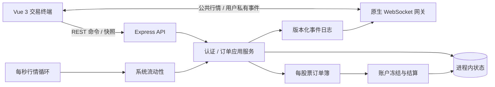

# PaperTrade 股票模拟交易系统

PaperTrade 是一个面向面试演示的内存股票模拟交易系统。它使用真实的价格优先、同价时间优先撮合规则，提供 AAPL、MSFT、TSLA 三支股票的模拟行情、系统流动性、用户间成交、资产冻结与结算，以及 WebSocket 实时更新。

> **重要限制：**这是教学和演示用途的模拟系统，不连接交易所，不使用真实行情或真实资金。所有状态都在单个 Node.js 进程的内存中；服务重启会清空用户、会话、委托、持仓、行情和成交记录。

## 功能

- 注册、登录、退出和基于 `HttpOnly` Cookie 的同源会话；新用户获得 1,000,000.00 虚拟资金。退出登录会立即使对应会话失效并关闭其 WebSocket，不影响其他用户。
- AAPL、MSFT、TSLA 每秒更新模拟价格；系统在参考价两侧各维护三档流动性。
- 限价单按价格优先、同价时间优先撮合，支持未成交、部分成交、完全成交和撤单。
- 真实用户之间可以成交；系统参与者也走相同的订单、撮合和结算路径。
- 买单严格冻结“限价 × 数量”，卖单严格冻结委托数量；成交价改善立即退回差额，撤单释放剩余冻结资产。
- 对真实用户启用自成交防护（STP）：当下一张有优先权的对手单属于同一用户时，取消新订单的未成交部分并释放冻结资产。系统账户不受此限制。
- 专业终端式响应式界面展示行情、最佳买卖价、60 秒走势、资产、委托、持仓和最近成交。
- WebSocket 只推送已提交的状态变化；服务端每 3 秒发送应用层心跳，浏览器连续 10 秒收不到任何有效消息时会主动放弃静默连接并指数退避重连，再通过 `/api/bootstrap` 快照与缓冲增量事件恢复一致状态。

## 三分钟启动

环境要求：

- Node.js `^20.19.0`、`^22.12.0` 或 `>=24.0.0`；推荐 Node.js 24 LTS。
- npm（随上述 Node.js 安装；本项目验证环境为 npm 11）。
- Git，以及可选的 Docker Desktop / Docker Engine + Compose v2。

### 本地开发

```bash
npm ci
npm run dev
```

打开终端中 Vite 输出的地址，默认是 `http://localhost:5173`。开发模式同时启动：

- Web：Vite 默认端口 `5173`，将 `/api` 和 `/ws` 代理到后端。
- Server：Express + WebSocket 默认端口 `3000`。

首次打开后进入 `/register`，注册一个 3～32 位小写字母、数字或下划线组成的用户名，并使用 8～72 位密码。

本地验证生产构建：

```bash
npm run build
npm start
```

然后打开 `http://localhost:3000`。`npm start` 只启动已有构建产物，因此修改源码后要先重新运行 `npm run build`。生产服务读取 `PORT`，默认值为 `3000`；例如 PowerShell 可用 `$env:PORT=3100; npm start`。

### Docker 一键启动

确保 Docker daemon 正在运行，然后在项目根目录执行：

```bash
docker compose up --build
```

打开 `http://localhost:3000`。Compose 读取 `APP_PORT` 作为宿主机端口，容器内始终监听 `3000`；例如复制 `.env.example` 为 `.env` 后把 `APP_PORT=3100`，即可从 `http://localhost:3100` 访问。

查看健康状态或停止服务：

```bash
docker compose ps
docker compose down
```

健康检查访问 `/api/health`。Docker Compose 一键构建、启动和容器内业务流程已经可用。

## 演示流程

单浏览器演示系统流动性：

1. 注册后进入交易终端，确认顶部 WebSocket 状态为“实时连接正常”，并观察三支股票每秒更新。
2. 选择 AAPL，点击“最佳卖价”填入买价，输入 `100` 股并买入。系统卖单提供流动性，持仓和最近成交会实时更新。
3. 点击“最佳买价”填入卖价并卖出 `100` 股，确认持仓回到 0，最近成交中同时出现买入和卖出。
4. 另挂一张不穿透盘口的限价单，观察资金或持仓进入冻结状态，再撤单确认冻结资产释放。

双浏览器演示真实用户撮合（必须使用两个独立浏览器配置文件或一个无痕窗口，避免共享会话 Cookie）：

1. 浏览器 A、B 分别注册用户 A、用户 B。
2. 用户 B 先用明显高于三档最佳卖价的限价买单买入至少 `700` 股；系统每侧三档总量为 `600` 股，等待后续行情周期补充流动性，直到 B 的可用持仓达到 `700`。
3. 用户 B 以高于当前系统最佳卖价的价格挂出 `700` 股卖单，使其保持在订单簿中。
4. 用户 A 以相同或更高价格买入 `700` 股。A 会先消耗价格更优的系统卖单，随后至少有一部分与 B 的真实用户卖单成交。
5. 在两端检查持仓、资金和最近成交：A 获得股票，B 的卖单发生部分或全部成交，双方都通过各自的 WebSocket 收到私有更新。

系统每秒刷新挂单，演示时以界面显示的实时最佳价和实际成交记录为准。

## 测试与质量检查

```bash
npm run lint
npm run typecheck
npm test
npm run build
npm run test:e2e
```

- `npm test`：运行 shared、server 和 web 的 Vitest 单元/集成测试。
- `npm run test:e2e`：先构建确定性 E2E 版本，再以 Playwright Chromium 运行完整买入、卖出冒烟流程。
- `npm run build`：依次构建共享契约、Vue 前端和 Express 服务端。

首次运行 E2E 前如缺少 Chromium，请安装浏览器二进制：

```bash
npx playwright install chromium
```

检查全仓格式但不改文件：

```bash
npx prettier --check .
```

## 架构



开发环境由 Vite 提供页面并代理 API/WS；生产环境由 Express 同时提供静态页面、REST 和 WebSocket，仅暴露一个端口。后端采用模块化单体，一次下单、撮合、结算和事件提交在同一进程的同步调用链中完成。

生产静态托管会保留 `/api` 和 `/ws` 命名空间，不会把未知接口误写为 SPA 页面。每个 HTTP 响应都带有 `X-Request-Id`；未知服务端异常按同一请求 ID 记录错误和堆栈，但不会记录请求体或 Cookie，客户端只收到不泄露内部细节的通用错误。

## 关键架构决策

1. **整数金额：**所有价格和资金都以最小货币单位（minor unit，等同两位小数货币的“分”）存储和传输；例如 `18700` 显示为 `187.00`。数量也必须是安全正整数，从根源上避免浮点结算误差。
2. **严格预冻结与 STP：**订单接受前一次性冻结完整资产，部分成交、价差退款、撤单和自成交防护均精确释放剩余部分，确保资金和持仓永不为负。
3. **快照 + 增量恢复：**每个已提交业务事件都有唯一 `eventId` 和单调递增 `stateVersion`。WebSocket 重连时先缓冲事件，再用 `/api/bootstrap` 替换本地快照，丢弃旧版本并按版本应用更新事件，以处理丢包、重复和重连竞态。应用层心跳让浏览器能识别“连接仍显示打开但已经不再收消息”的半开连接；服务端同时用 WebSocket ping/pong 回收失联客户端。
4. **混合流动性模块化单体：**真实用户可以彼此成交；两个内部系统账户围绕随机游走参考价挂单，保证单人也能演示。共享契约、前端、后端模块分离，但不引入数据库、消息队列或分布式事务。

## 项目结构

```text
apps/
  web/                 Vue 3、Pinia、Vue Router、终端组件和前端测试
  server/              Express、认证、订单、撮合、结算、行情、WS 和测试
packages/
  shared/              前后端共享的领域类型、Zod API 契约和事件协议
e2e/                   Playwright 注册—买入—卖出冒烟流程
docs/
  prompts.md            真实需求与审查决策的摘要记录
  superpowers/          设计规格与实施计划
Dockerfile              多阶段生产镜像
docker-compose.yml      单服务部署、端口映射和健康检查
```

## 已知限制

- **无持久化：**重启服务或容器会清空用户、会话、委托、持仓、行情和成交；不适合保存任何重要数据。
- **非真实交易：**行情由随机游走产生，资金为虚拟资金，不连接券商或交易所，也不构成投资建议。
- 只支持 AAPL、MSFT、TSLA 和限价单；不支持市价单、止损单、碎股、手续费、税费、融资融券或公司行动。
- 仅适用于单 Node.js 进程；不支持多实例状态同步、水平扩展和高可用。
- 成交历史有内存上限，系统流动性的终态订单和对应幂等记录会在刷新后回收；真实用户的委托和幂等记录仍保留到进程重启。界面只展示当前用户的近期成交；不提供完整 K 线、深度盘口或管理后台。

常见故障排查：

- **端口被占用：**开发模式检查 `3000`/`5173`；生产模式设置 `PORT`；Docker 设置 `APP_PORT`。也可先停止占用端口的旧进程或容器。
- **Docker 无法连接：**若出现 daemon/engine 连接错误，先启动 Docker Desktop 或 Docker Engine，再运行 `docker info` 确认服务端可用，然后重试 Compose。
- **Playwright 找不到浏览器：**运行 `npx playwright install chromium`；在 Linux CI 中可按环境权限使用 `npx playwright install --with-deps chromium`。
- **页面可打开但 API/WS 失败：**开发模式确认 `npm run dev` 的两个工作区都在运行；生产模式确认已经执行 `npm run build`，并访问 `/api/health` 检查服务状态。
- **连接状态反复显示“正在重连”：**客户端在 10 秒内收不到任何有效 WebSocket 消息会主动重连。先检查反向代理是否正确转发 `/ws`、是否允许 WebSocket Upgrade，以及代理或防火墙是否阻断长连接；恢复后客户端会自动重新获取快照。
